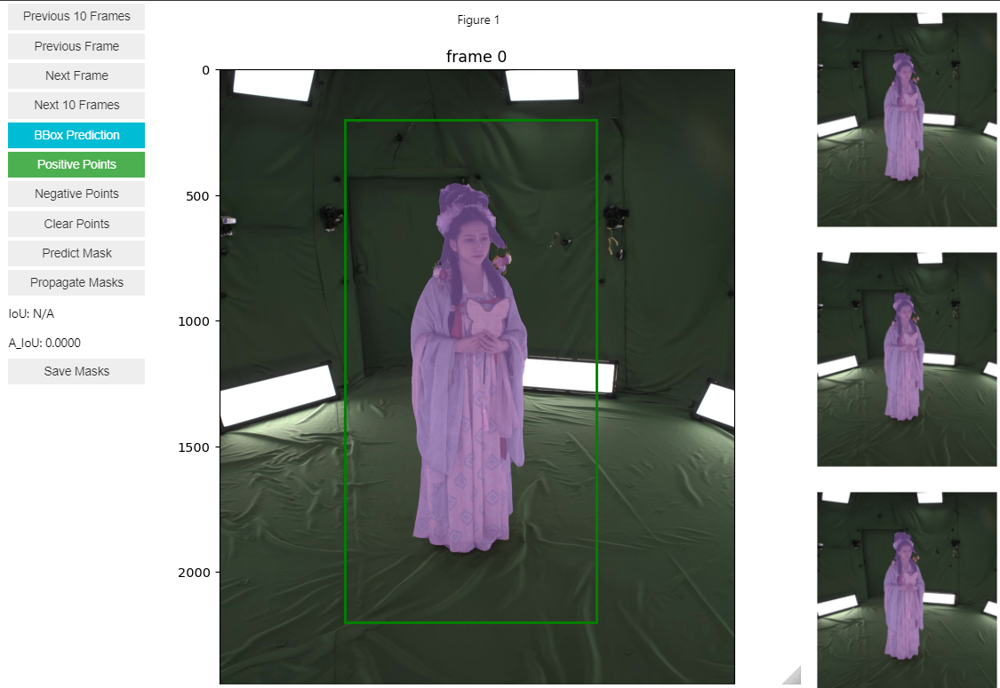

# 23DSegment

This repository includes 2D and 3D segmentation methods aimed to the annotation of garments in multi-view videos clothed human datasets. 

- The 2D annotation tool makes use of SAM 2 with the video propagation method, allowing to annotate one frame and propagate the mask through the video sequence. The video_annotation jupyter notebook includes a simple interactive interface to annotate sequences directly inside the notebook. This can be run in a headless environment with no display option available, meaning it can be run directly in a docker container supported on an ssh connection.

  

- The 3D annotation tool makes use of the 4D Dress Human Parsing model, from https://github.com/eth-ait/4d-dress.git. This is a semi-automatic tool to produce 3D segmentation masks using rendered multi-views leveraging the scanned 3D human body shape. Instructions on how to run the different steps are included in the visualize_predictions jupyter notebook.